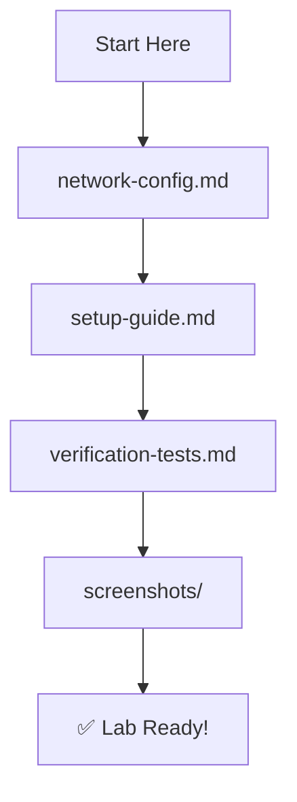

# Offensive Security Lab: Isolated Attack Surface

## 🔥 Executive Summary
A purpose-built virtual environment for practicing penetration testing methodologies in a completely isolated setting. This lab demonstrates how to safely simulate real-world attacks while maintaining zero risk to external networks.

## 📊 Lab Specifications
| Component | Specification | Purpose |
|-----------|--------------|---------|
| **Hypervisor** | VMware Workstation 17 Pro | Virtualization & network isolation |
| **Attacker OS** | Kali Linux 2025.2 | Penetration testing platform |
| **Target OS** | Metasploitable 2 | Intentionally vulnerable system |
| **Network Design** | Dual-segment isolation | Safe attack surface containment |

## 🎯 Core Objectives
1. **Safe Practice**: Zero external network impact
2. **Methodology Focus**: Process over tool proficiency
3. **Evidence-Based**: Documented verification of all claims

## 🛡️ Security Controls Implemented
- **Network Segmentation**: NAT + Host-Only virtual networks
- **Traffic Containment**: All attack traffic confined to VMnet1
- **Access Control**: No inbound internet to target systems
- **Audit Trail**: Comprehensive documentation and screenshots

## 📁 Documentation Structure
```
offensive-lab/
├── README.md
├── network-config.md
├── setup-guide.md
├── verification-tests.md
└── screenshots/
```

## 📚 Documentation Guide

### **More Detailed**

```markdown
### Phase 1: Planning & Design 
📋 Document: **(network-config.md)**
- Design network architecture
- Plan IP addressing
- Configure VMware virtual networks

### Phase 2: Implementation
🔧 Document: setup-guide.md
- Install Kali Linux VM
- Deploy Metasploitable 2
- Configure network interfaces

### Phase 3: Verification
✅ Document: verification-tests.md
- Test connectivity
- Verify isolation
- Confirm security controls

### Phase 4: Documentation
📸 Folder: screenshots/
- Capture evidence
- Document results
- Create visual proof
```
**Tabular**

| Document | Purpose | When to Use |
|----------|---------|-------------|
| **[network-config.md](network-config.md)** | Architecture & IP planning | Understanding lab design |
| **[setup-guide.md](setup-guide.md)** | Step-by-step installation | First-time setup or VM recreation |
| **[verification-tests.md](verification-tests.md)** | Validation procedures | Confirming lab functionality |
| **[screenshots/](screenshots/)** | Visual evidence | Verifying setup steps |

## 🏗️ Build Workflow



## ⚠️ Legal & Ethical Notice
> This lab exists solely for educational purposes within an isolated virtual environment. All documented activities are performed against intentionally vulnerable systems that have no connectivity to external networks. This lab follows responsible disclosure principles and ethical testing guidelines.

---

*"The most secure lab is one that's intentionally vulnerable in the right places."*

