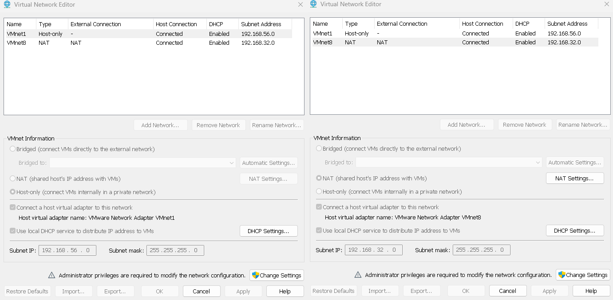
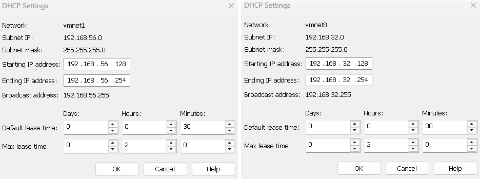
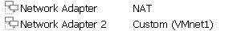

## 🏗️ Virtual Network Architecture

### 1.1 Configure VMware Virtual Networks
**Objective**: Create isolated segments for different traffic types

### ✅ Network Editor Configuration Checklist

- [ ] **Launch Network Editor**
  - Open VMware Workstation
  - Click `Edit` → `Virtual Network Editor`
  - Grant administrator permissions if prompted

- [ ] **Configure VMnet8 (NAT Network)**
  - [ ] Type: NAT
  - [ ] Subnet IP: `192.168.32.0`
  - [ ] Subnet Mask: `255.255.255.0`
  - [ ] Gateway: `192.168.32.2`

- [ ] **Configure VMnet1 (Host-Only Network)**
  - [ ] Type: Host-only
  - [ ] Subnet IP: `192.168.56.0`
  - [ ] Subnet Mask: `255.255.255.0`
  - [ ] DHCP: Disabled

### (optional) if full isolation needed on kali 
- [ ] **Apply Security Hardening**
  - [ ] Disable VMnet0 (Bridged)
  - [ ] Disable all unused VMnets
  - [ ] Click `Apply` to save changes

## Network Configuration Evidence

### 1. VMware Virtual Network Editor

  

*Configuring VMnet1 (Host-Only) and VMnet8 (NAT) networks*

### 2. Subnet Settings

*192.168.56.0/24 (lab) and 192.168.32.0/24 (internet) subnets*

### 3. Kali Linux VM Configuration

  

*Kali VM with dual network adapters for segmented testing*

### 1.2 IP Address Planning

| Device          | Interface | Network             | IP Address      | Gateway     | Purpose         |
|-----------------|-----------|---------------------|-----------------|-------------|-----------------|
| Kali Linux      | eth0      | VMnet8 (NAT)        | 192.168.32.128  | 192.168.32.2| Internet Access |
| Kali Linux      | eth1      | VMnet1 (Host-Only)  | 192.168.56.128  | N/A         | Attack Traffic  |
| Metasploitable2 | eth0      | VMnet1 (Host-Only)  | 192.168.56.129  | N/A         | Vulnerable Target |

### 1.3 Network Architecture Overview

  

*Lab network segmentation strategy showing isolated attack surface*

**Design Features:**
- ✅ Complete isolation from production networks
- ✅ Dual-segment architecture for controlled testing
- ✅ No internet access for vulnerable target
- ✅ Host system protected from lab traffic

## Network Architecture

View interactive diagram: **[network-topology.drawio](diagrams/Strategic-Network-Segmentation.drawio)**

GitHub will automatically show a preview with an "Edit" button that opens in Draw.io!

## 🏗️ Network Architecture

### Interactive Diagram

*Click the preview above to view the interactive diagram in GitHub*

temp try:
## 🏗️ Interactive Network Architecture

### Live Diagram Viewer
[](https://viewer.diagrams.net/?tags=%7B%7D&lightbox=1&highlight=0000ff&edit=_blank&layers=1&nav=1&title=Strategic%20Network%20Segmentation.drawio&dark=auto#R%3Cmxfile%3E%3Cdiagram%20name%3D%22Page-1%22%20id%3D%228NOXjuymnfao87ymoqRj%22%3E7Vtbd6I6FP41rnXOQ1mQgOhjtbZ1TWs7o2d6et5QomYViQfipfPrZ0fCLejoWHFNS%2B1DZSduQr5vX4Eabs%2FWN4Ezn94zl3g1pLvrGr6qIWQYugH%2FhOQ1ktg6jgSTgLpyUiro0x9ECnUpXVCXhLmJnDGP03leOGK%2BT0Y8J3OCgK3y08bMy5917kxIQdAfOV5R%2BkRdPo2kuKGn8ltCJ1N5ZozkwNAZvUwCtvDl6Xzmk2hk5sRa5NRw6rhslRHhTg23A8Z49G22bhNP7Gq8YdHvrneMJisOiM8P%2BcHzv3Vy8Y%2F%2B9b8bzhpXw3bjR%2Fj1wipqkYpD%2FhpvTvhC%2BEhcjF7DrTmjPidBZwk%2FEJtugCy5NDHBdcIpceXBlM%2B8eBIP2AtpM48FINlsFG6NqefFohrCJjZN0wK5E84jmMd0LZS1PGdIvEcWUk6ZD%2FIREauAgSUJOAUg75QJQ8Y5m2UmXHp0IgY4m4sTyKNED1twj%2FqwvphgenRhc7EJs%2FVE8F5bLl3NJ3zFghfqT2BCtFdLx1vIvZICOCdZZ%2FZTQnJD2Izw4BWmTDN0MiVFVin1YpFUguvy%2BDW2G3nsSOJPEs0pBeCLZMFvMKJ%2BCCPg4nge3dWUctKfOyMxYwWbdQjiUlTAQoVsRl1XnLq1sbSEXFs2v%2B6JdY0ZLB28QLQakP6%2FEFbWuluMqOvACKAcMtCYjMC3ifjfFSsAhGNNsIWRsmj4KHRxEd26gq6VR9cuC1w70kvcgjf8FdrEdy%2BFjxUQeU4Y0lEe%2B72o7Nuh%2BPID4jmcLvNry2yb9Yt9kWd4FO4ps7N2U7PylqMqCdkiGBH5u6z%2F3KsqiV6xKu4EE8ILqjZQJZd%2BPHrNQ8A60h9mHbXi9IYOIK4FG6%2BYmi9K7Tey8zhublREAR4JPlDgxma51sn8JdKLJpWEZKkmibuvyvHJjco4KIh%2BWJfZuxzAcC%2BKivDtr1jlMJ7x%2FR48aiPjUpORv0%2FpZ7dE0cTYYxs2zkYKu9KkMJpIM%2BoNDSMNdvgamWUDreZLKtBmaUA3Kg10wdgfF8GchWSbtdfwZaQKLtPzYFVIT%2FMtvTMJSBiWzBOkOARkKSG9XhpPDoreauyVxUaINDoSYbxYGCkVVOdK%2FBW4BCP65gMjoNmlsIbMmNWqG3UMY%2FJ8qAtn68dVnZEZGE6ui3w8vjjby%2BQoO8kua%2BvuzJhPuVhSburzw3gcErFbF7qm601l%2BEm5NiG7Faai2SY6WbKCbW13JhvTsJl3V1jNLE9GwzjgVdRdfYG1wPgd9RfrM4ckZOZdDTYTYpwe5YPqug%2BLciEoET7Vd0ekTLJioMaZU9JkTkyL0op%2FJFs7Va7%2BTXyy6t9snrf6RwdVFJUo%2Fxu%2FX%2F5bpTVM0UEFwGdiV83EzrYVtwF4aHEmcHoufhYZn1zcxUUT8pszchG%2F50qjC4mlwzctikvOndHLIS1OY0eL8xg8t7QudGuPaykvxuH3XE%2FE6b1VT3qRZ0OktP4yRu8YkTc2DROL7C%2BCTXV4PjxLayNj%2FAHw%2FPP6MltQNtIwGOOM6xpSIqMF%2FqK0yGhWGutt3ZmtoTPfnQH3feLuzDZymFizVXboWh3n2WGXyY5q306%2BJxzKD49R7gw9gs7cjcONQo5s4RKxrvbTVjnTbpZt2shW%2FD5upsZ%2BFsuu9jMBvQcY7fYGnW%2B9jnhkpP3Q63Xag%2B737uB5J%2FaR2KVLVfTGddw%2B9DePrXQGTw%2Ffvoikst3u9Pt71gHi3FLOlXfaatv6ZJw033Nl9xYuZC4vQxCFKsVCP6o9WiybpZbzONMWojSV5qLyULDVKLGdY36EgvOMRBls7gb9ASwxDTWlKZcnsrip0F1Gs9DjP%2FYuYxGrgqqS7zKa1c5IC2a85YWAoTr5PC8JmIq3x3ZpJly51wRM9dmcRlMz9Wb6sY%2B0Z32LXkNPPsrzP0fbNhymL5JF09P39HDnJw%3D%3D%3C%2Fdiagram%3E%3C%2Fmxfile%3E)

*Click the image above to open interactive viewer with zoom, layers, and edit options*
