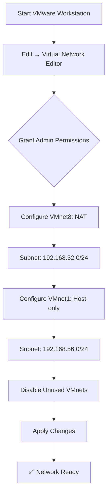

## 🏗️ Virtual Network Architecture

### 1.1 Configure VMware Virtual Networks
**Objective**: Create isolated segments for different traffic types

### 🏗️ VMware Network Architecture Setup

#### Phase 1: Initialization
| Step | Action | Expected Result |
|------|--------|-----------------|
| 1.1 | Launch VMware Workstation | VMware interface opens |
| 1.2 | Navigate to Edit → Virtual Network Editor | Network Editor window appears |
| 1.3 | Grant administrator permissions | "Change Settings" button available |

#### Phase 2: Network Configuration
| Network | Parameter | Value | Purpose |
|---------|-----------|-------|---------|
| **VMnet8** | Type | NAT | Internet egress |
| | Subnet | 192.168.32.0/24 | NAT network range |
| | Gateway | 192.168.32.2 | Default route |
| **VMnet1** | Type | Host-only | Isolated lab |
| | Subnet | 192.168.56.0/24 | Attack surface |
| | DHCP | Disabled | Manual IP assignment |

#### Phase 3: Security Hardening
```bash
# Disable unused networks for isolation
VMnet0 (Bridged) → Disabled
VMnet2-7 → Disabled
VMnet9+ → Disabled
```

### ✅ Network Editor Configuration Checklist

- [ ] **Launch Network Editor**
  - Open VMware Workstation
  - Click `Edit` → `Virtual Network Editor`
  - Grant administrator permissions if prompted

- [ ] **Configure VMnet8 (NAT Network)**
  - [ ] Type: NAT
  - [ ] Subnet IP: `192.168.32.0`
  - [ ] Subnet Mask: `255.255.255.0`
  - [ ] Gateway: `192.168.32.2`

- [ ] **Configure VMnet1 (Host-Only Network)**
  - [ ] Type: Host-only
  - [ ] Subnet IP: `192.168.56.0`
  - [ ] Subnet Mask: `255.255.255.0`
  - [ ] DHCP: Disabled

- [ ] **Apply Security Hardening**
  - [ ] Disable VMnet0 (Bridged)
  - [ ] Disable all unused VMnets
  - [ ] Click `Apply` to save changes
     
### 🔄 Configuration Workflow




## Network Configuration Evidence

### 1. VMware Virtual Network Editor

<div align="center">
  


*Configuring VMnet1 (Host-Only) and VMnet8 (NAT) networks*
</div>

### 2. Subnet Settings

<div align="center">


*192.168.56.0/24 (lab) and 192.168.32.0/24 (internet) subnets*
</div>

### 3. Kali Linux VM Configuration
<div align="center">
  


*Kali VM with dual network adapters for segmented testing*
</div>

### 1.2 IP Address Planning

| Device          | Interface | Network             | IP Address      | Gateway     | Purpose         |
|-----------------|-----------|---------------------|-----------------|-------------|-----------------|
| Kali Linux      | eth0      | VMnet8 (NAT)        | 192.168.32.128  | 192.168.32.2| Internet Access |
| Kali Linux      | eth1      | VMnet1 (Host-Only)  | 192.168.56.128  | N/A         | Attack Traffic  |
| Metasploitable2 | eth0      | VMnet1 (Host-Only)  | 192.168.56.129  | N/A         | Vulnerable Target |


### 1.3 Network Architecture Overview

<div align="center">
  


*Lab network segmentation strategy showing isolated attack surface*
</div>

**Design Features:**
- ✅ Complete isolation from production networks
- ✅ Dual-segment architecture for controlled testing
- ✅ No internet access for vulnerable target
- ✅ Host system protected from lab traffic
