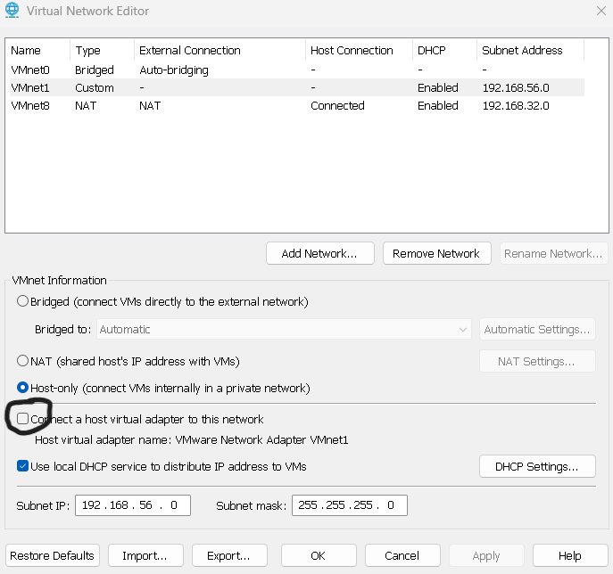

## 🏗️ Virtual Network Architecture

### 1.1 VMware Network Configuration

**Objective:** Create isolated segments for internet access and lab traffic.

#### Configuration Checklist

- [ ] **Launch Network Editor**
  - Open VMware Workstation → `Edit` → `Virtual Network Editor`
  - Grant administrator permissions if prompted

- [ ] **Configure VMnet8 (NAT Network)**
  - Type: NAT
  - Subnet: `192.168.32.0/24`
  - Gateway: `192.168.32.2`

- [ ] **Configure VMnet1 (Host-Only Network)**
  - Type: Host-only
  - Subnet: `192.168.56.0/24`
  - DHCP: Disabled

- [ ] **Apply Security Hardening (Optional)**
  - Disable VMnet0 (Bridged)
  - Disable all unused VMnets
  - Click `Apply` to save changes

---

### Network Configuration Evidence

#### 1. VMware Virtual Network Editor

  
   
  <em>Configuring VMnet1 (Host-Only) and VMnet8 (NAT) networks</em>

#### 2. Subnet Settings

  
   
  <em>192.168.56.0/24 (lab) and 192.168.32.0/24 (internet) subnets</em>

---

### 1.2 IP Address Planning

| Device | Interface | Network | IP Address | Gateway | Purpose |
|--------|-----------|---------|------------|---------|---------|
| Kali Linux | eth0 | VMnet8 (NAT) | 192.168.32.128 | 192.168.32.2 | Internet Access |
| Kali Linux | eth1 | VMnet1 (Host-Only) | 192.168.56.128 | N/A | Attack Traffic |
| Metasploitable 2 | eth0 | VMnet1 (Host-Only) | 192.168.56.129 | N/A | Vulnerable Target |

---

### 1.3 Network Architecture Overview

  
   
  <em>Network segmentation diagram showing NAT and Host-Only isolation</em>

**Design Features:**
- ✅ Complete isolation from production networks
- ✅ Dual-segment architecture for controlled testing
- ✅ No internet access for vulnerable target
- ✅ Host system protected from lab traffic

---

### 1.4 Network Isolation Fix

**Issue:** Host machine could ping Metasploitable (security risk)

**Fix:** Disabled host virtual adapter for VMnet1 in VMware Network Editor

  
   
  <em>Disabling host virtual adapter for VMnet1</em>

---

### 🎓 Lesson Learned

> *"Isolation isn't automatic—you must verify it. A simple ping test from host to target should always fail in a properly configured security lab."*

**Result:** Host now cannot access lab network; proper isolation achieved

