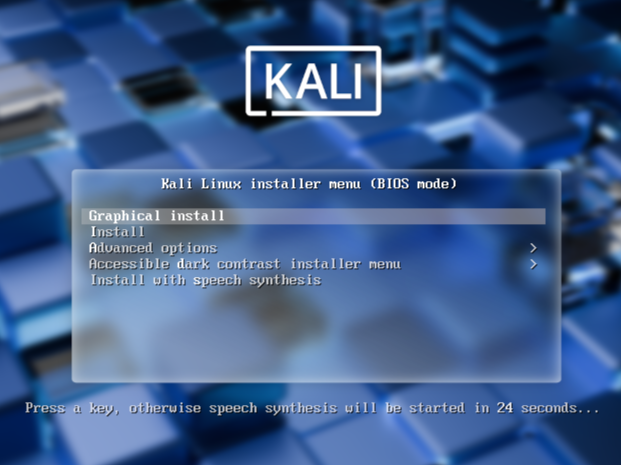
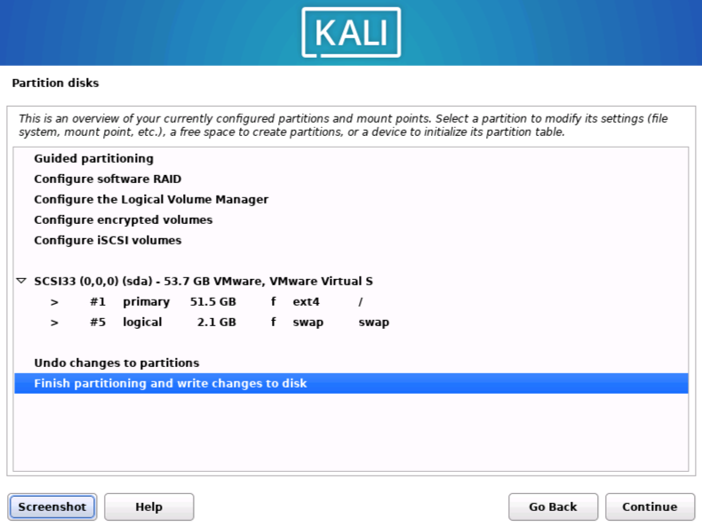
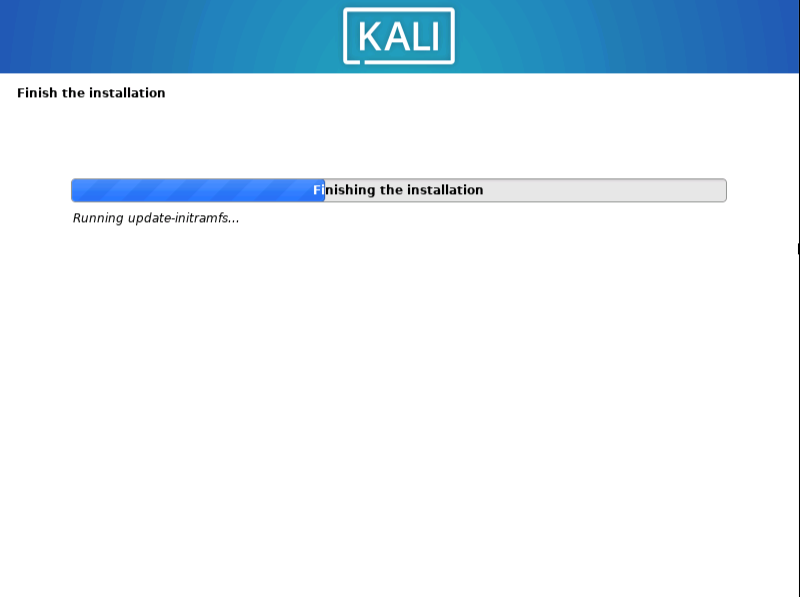
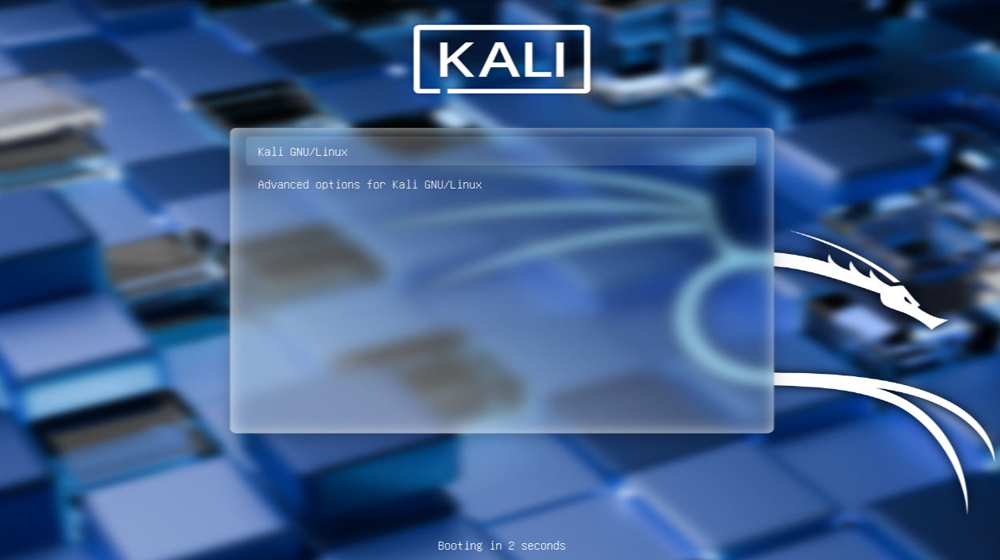
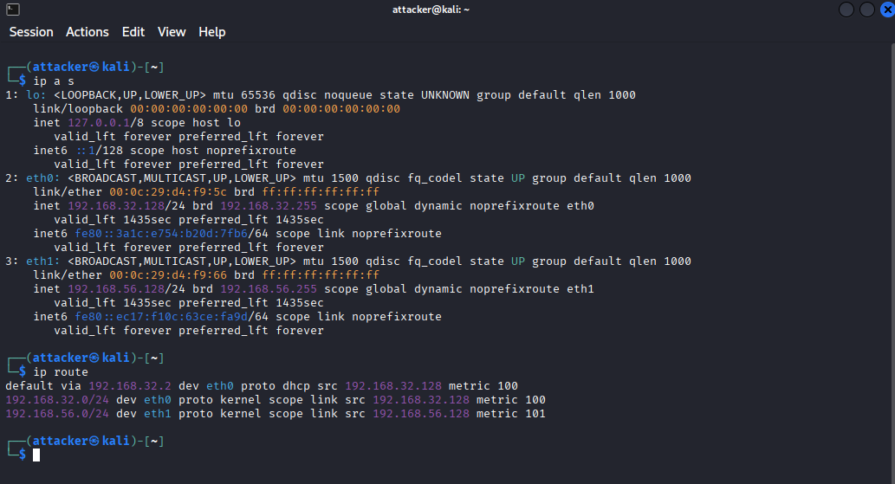
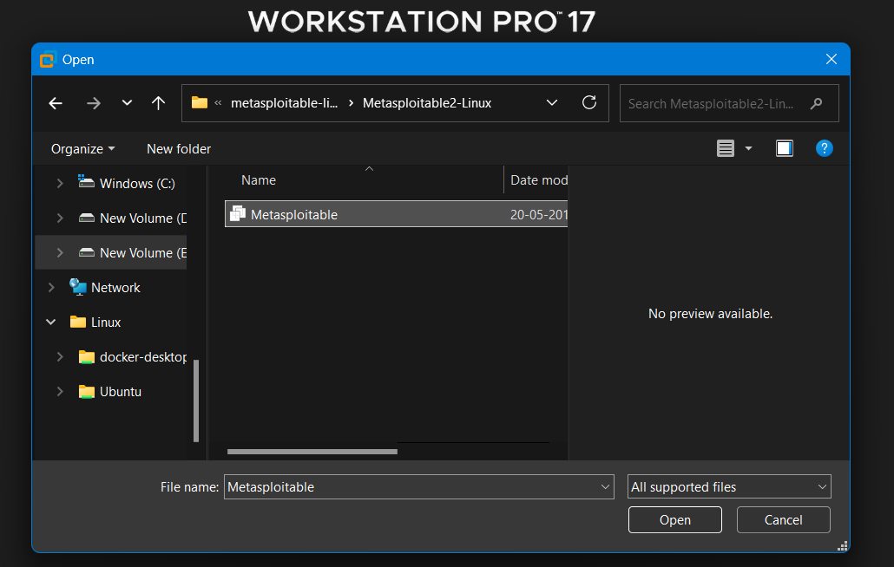
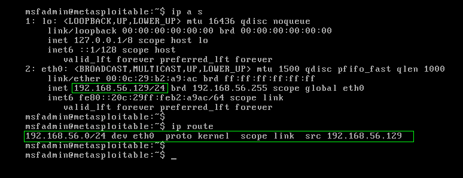
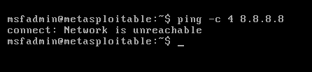

# Offensive Lab Setup Guide

## 📋 Prerequisites
- VMware Workstation 17 Pro (or equivalent)
- 4GB+ RAM recommended
- 50GB+ free disk space
- Administrative access to host system

---

## 🖥️ Phase 1: Kali Linux Setup

### 1.1 Virtual Machine Configuration

| Component | Configuration |
|-----------|---------------|
| **OS** | Debian 11.x (64-bit) |
| **RAM** | 4096 MB |
| **CPU** | 2 cores |
| **Disk** | 50 GB (split) |
| **Network Adapter** | NAT + Host-Only |

---

### 1.2 Installation Process

- Boot from the Kali Linux ISO  
- Select **Graphical Install**

**Installation choices:**
- **Language:** English (United States)
- **Network configuration:**
  - Hostname: `kali`
  - Domain: `lab.local` (or leave blank)
- **Partitioning:** Use entire disk → All files in one partition
- **Bootloader:** Install GRUB to the master boot record

---

### Evidence to Capture

<div align="center">
  
  <br>
  <em>VM configuration with 4GB RAM, 2 CPU cores, and dual network adapters</em>
</div>

<br>

<div align="center">
  
  <br>
  <em>Kali Linux boot menu - selecting Graphical Install</em>
</div>

<br>

<div align="center">
  
  <br>
  <em>Disk partitioning selection - using entire disk</em>
</div>

<br>

<div align="center">
  
  <br>
  <em>Installation in progress - extracting and installing packages</em>
</div>

<br>

<div align="center">
  
  <br>
  <em>Installation finished with GRUB bootloader installed</em>
</div>

<br>
---

### 1.3 Post-Installation Configuration

After installation, update the system and verify networking:

```bash
# Update system packages
sudo apt update && sudo apt upgrade -y
### Verification
```bash
ip a
ip route
```

### Evidence to Capture
<div align="center">
  
  <br>
  <em>`ip a` and `ip route` output showing eth0 (NAT: 192.168.32.128) and eth1 (Host-Only: 192.168.56.128)</em>
</div>

<br>

---

## 🎯 Phase 2: Metasploitable 2 Deployment

### 2.1 Download & Verification

```bash
# Using wget
wget https://downloads.metasploit.com/data/metasploitable/metasploitable-linux-2.0.0.zip

# OR using curl
curl -O https://downloads.metasploit.com/data/metasploitable/metasploitable-linux-2.0.0.zip

# Verify SHA256 hash
sha256sum metasploitable-linux-2.0.0.zip
# Expected: d97c2f6a3bfb5d5b86c6c95c3d0e24c2b1f6e7a7e8f9c0a1b2c3d4e5f6a7b8c9d
```

### 2.2 Import & Configuration

- Extract the ZIP archive to obtain the `.vmx` file

**VMware Import**
- File → Open → Select `Metasploitable.vmx`
- Accept any hardware compatibility warnings if prompted

**Network Configuration**
- Settings → Network Adapter → Host-Only (VMnet1)
- Remove all other network adapters

⚠️ **Critical Security Note**
- NEVER enable NAT or Bridged networking on Metasploitable2
- NEVER expose this VM to any network except the isolated lab network

---

### 2.3 Initial Boot & Verification

**Default credentials**
- Username: `msfadmin`
- Password: `msfadmin`

```bash
# Check network configuration
ifconfig
# Expected: only one interface with IP 192.168.56.129

# Attempt internet connectivity (should fail)
ping -c 4 8.8.8.8
```

<div align="center">
  
  <br>
  <em>Metasploitable VM imported into VMware with Host-Only network adapter</em>
</div>

<br>

<div align="center">
  
  <br>
  <em>`ifconfig` output showing single interface at 192.168.56.129</em>
</div>

<br>

<div align="center">
  
  <br>
  <em>`ping 8.8.8.8` fails - confirming no internet access (isolation working)</em>
</div>


---


