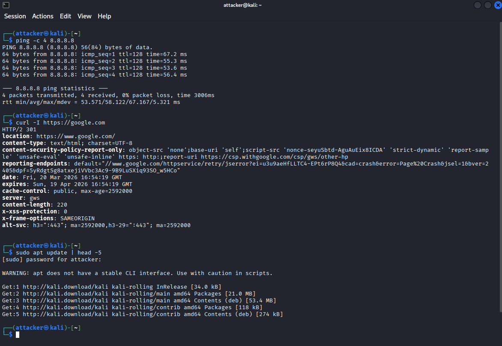
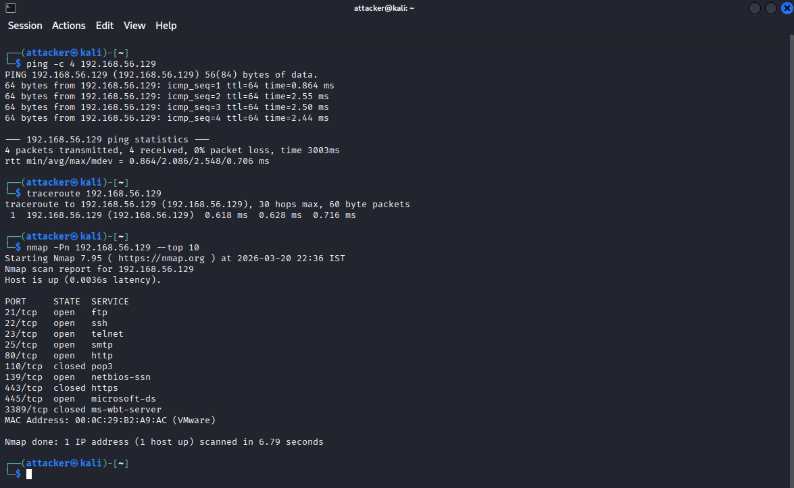
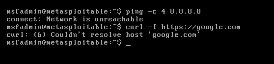
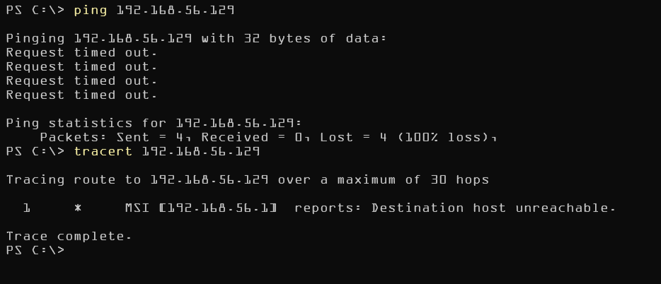
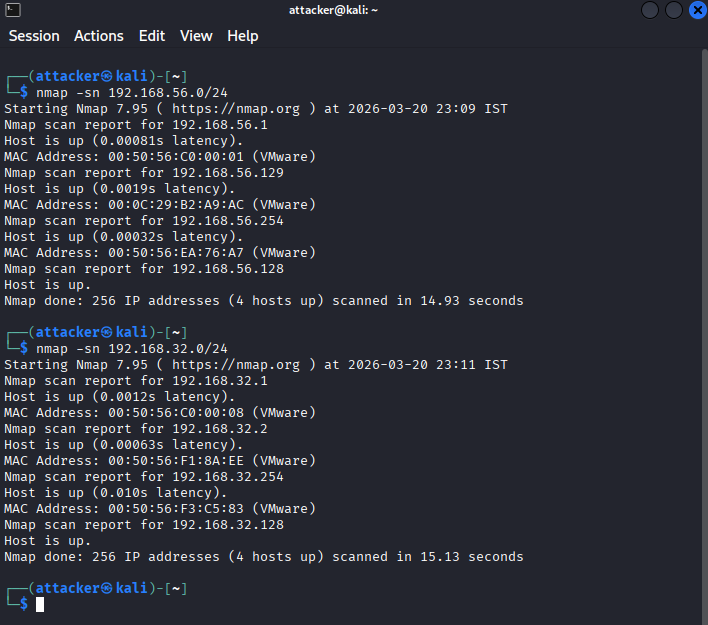

# Offensive Lab Network Validation

## 🎯 Purpose
To verify and document that the lab network operates as designed, with proper isolation and connectivity.

## 📊 Test Matrix
| Test ID | Test Description | Expected Result | Status | Evidence |
|---------|-----------------|-----------------|--------|----------|
| NET-001 | Kali internet access | Success | ✅ | [](screenshots/net-001.png) |
| NET-002 | Kali → Metasploitable | Success | ✅ | [](screenshots/net-002.png) |
| NET-003 | Metasploitable → Internet | Failure | ✅ | [](screenshots/net-003.png) |
| NET-004 | Host → Metasploitable | Failure | ✅ | [](screenshots/net-004.png) |
| NET-005 | Network isolation scan | 2 hosts only | ✅ | [](screenshots/net-005.png) |

## 🔍 Detailed Test Procedures

### Test NET-001: Kali Internet Connectivity
```bash
# Execute from Kali terminal
ping -c 4 8.8.8.8
curl -I https://google.com
sudo apt update | head -5

# Success Criteria: All commands execute without network errors
```

### Test NET-002: Attack Path Connectivity
```bash
# Execute from Kali terminal
ping -c 4 192.168.56.129
traceroute 192.138.56.129
nmap -Pn 192.168.56.129 --top-ports 10 

# Success Criteria:
# Ping: 0% packet loss
# Nmap: Shows at least 10 open ports
# Traceroute: Direct connection (1 hop)
```


### Test NET-003: Target Isolation Verification
```bash
# Execute from Metasploitable terminal
ping -c 4 8.8.8.8
curl --max-time 5 http://example.com
# Success Criteria: All commands timeout or fail (100% packet loss)
```

### Test NET-004: Host Machine Isolation
```bash
# Execute from Host OS (Windows/Linux/Mac)
ping 192.168.56.129
traceroute 192.168.56.129
# Success Criteria: No response from Metasploitable IP

```

### fixed isolation issue 
| Screenshot | Name | Description |
|------------|------|-------------|
| [View Image](screenshots/net-004-failure.png) | `net-004-failure.png` | Host pinging Metasploitable (FAIL) |
| [View Image](screenshots/net-004-fix.png) | `net-004-fix.png` | VMware Network Editor with VMnet1 unchecked |
| [View Image](screenshots/net-004-fixed.png) | `net-004-fixed.png` | Host ping timeout (PASS) |

### Test NET-005: Network Segment Purity
```bash
### Test NET-005: Network Segment Purity
**Objective:** Confirm lab VMs are present in each network

# From Kali terminal
# Scan Host-Only network
nmap -sn 192.168.56.0/24

# Scan NAT network
nmap -sn 192.168.32.0/24

# Expected Result:
VMnet1: Kali (192.168.56.128) + Metasploitable (192.168.56.129)
VMnet8: Kali (192.168.32.128) accessible
```

### Results NET-005:

| Network | IP Address | Device | Status |
|---------|------------|--------|--------|
| **VMnet1 (192.168.56.0/24)** | 192.168.56.1 | VMware virtual adapter | Expected |
| | 192.168.56.128 | Kali | ✅ Present |
| | 192.168.56.129 | Metasploitable | ✅ Present |
| | 192.168.56.254 | VMware DHCP | Expected |
| **VMnet8 (192.168.32.0/24)** | 192.168.32.1 | VMware gateway | Expected |
| | 192.168.32.2 | VMware NAT | Expected |
| | 192.168.32.128 | Kali | ✅ Present |
| | 192.168.32.254 | VMware | Expected |
```

```

# Result Summary 
{
  "test_date": "21-03-2026",
  "tester": "Divyanshu Gautam",
  "environment": "Offensive Security Lab v1.0",
  "tests_performed": 5,
  "tests_passed": 5,
  "isolation_verified": true,
  "connectivity_verified": true,
  "security_controls_effective": true
}
