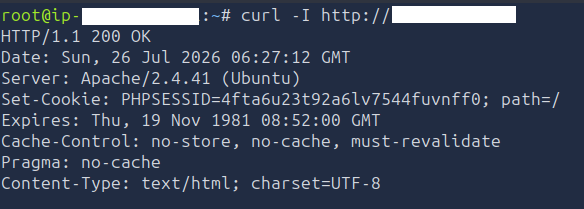
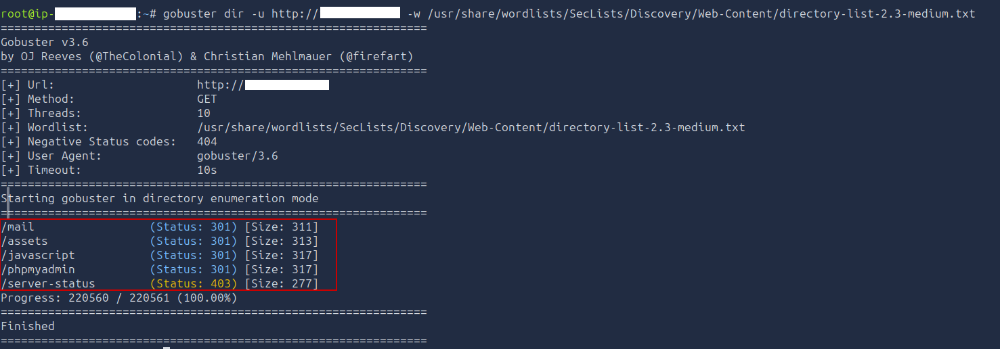
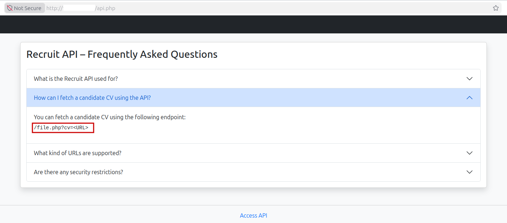
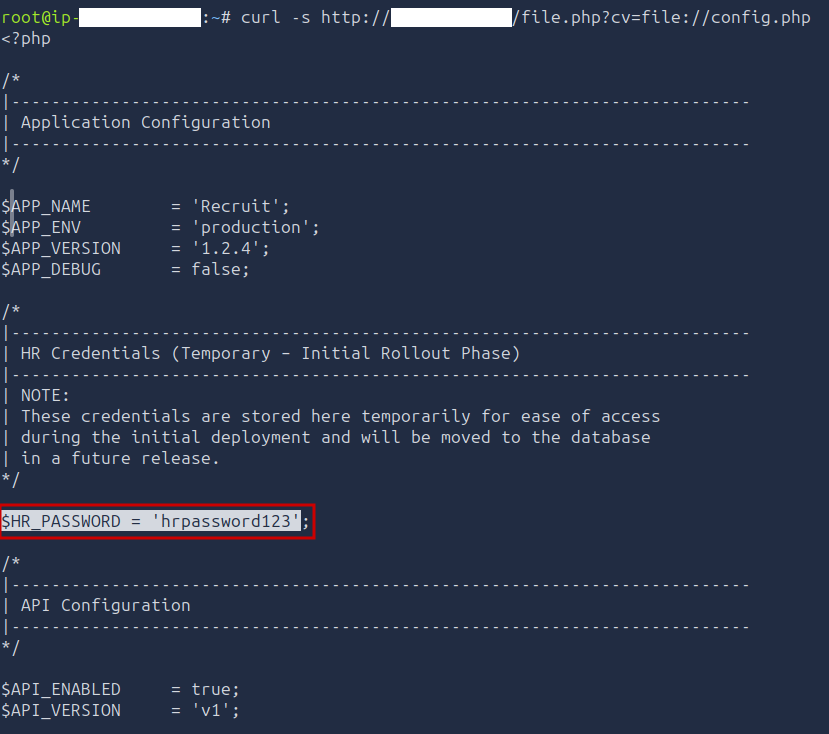
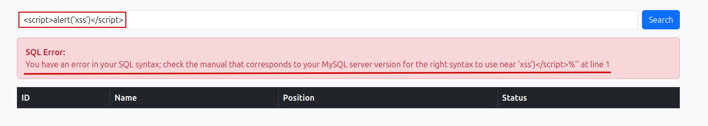
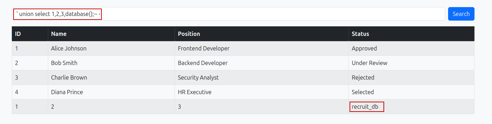
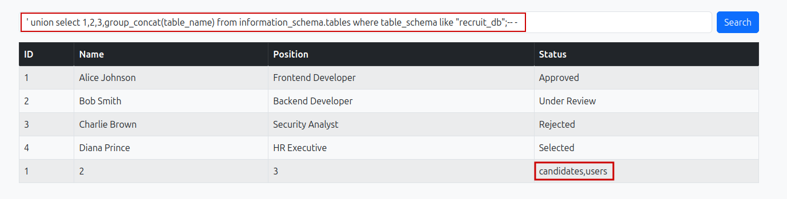
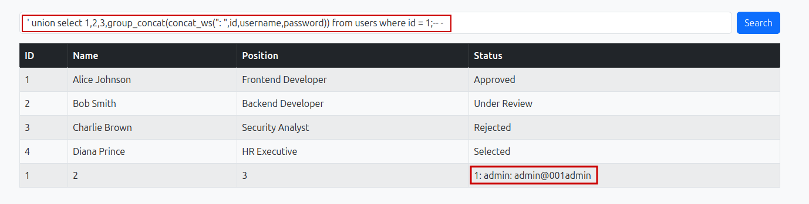

# TryHackMe - Recruit CTF Writeup

| Room Info | Details |
|-----------|---------|
| **Room Name** | Recruit |
| **Platform** | TryHackMe |
| **Difficulty** | Medium |
| **Focus Areas** | SSRF, PHP Stream Wrappers / LFI, UNION-based SQL Injection |
| **Note** | My first medium-difficulty web CTF completed primarily through independent reasoning |

---

## 📌 Executive Summary

The "Recruit" room simulated a recruitment platform vulnerable to a CV-fetching feature that could be abused via PHP stream wrappers to read local files, and a search feature vulnerable to UNION-based SQL injection. By chaining an SSRF-style file read with careful SQLi methodology, I escalated from unauthenticated access to full administrator credentials and captured both flags — the majority of this room was solved through independent research rather than a walkthrough.

---

## 🗺️ Attack Chain Overview

```mermaid
flowchart LR
    A["Directory enumeration"] -->|found /mail directory| B["HR username discovered"]
    B -->|found CV fetch endpoint| C["SSRF attempt blocked"]
    C -->|researched PHP stream wrappers| D["file wrapper local file read"]
    D -->|Flag 1| E["HR dashboard search feature"]
    E -->|accidental SQL error| F["UNION SQLi methodology applied"]
    F -->|column count and reflection enum| G["Dumped users table"]
    G -->|admin credentials extracted| H["Flag 2 - admin login"]
```

---

## 🔍 Detailed Walkthrough

### 1. Initial Reconnaissance

**Header & server enumeration:**
```bash
curl -I http://<TARGET>
```

<!-- Screenshot of headers/server info -->

**Source review:** Manually checked page source — nothing of immediate interest.

**Directory Enumeration:**
```bash
gobuster dir -u http://<TARGET> -w <WORDLIST>
```

<!-- Screenshot showing discovered endpoints -->

**Discovered:**
/mail
/assets
/phpmyadmin

**`/mail` directory findings:**
- HR username: `hr`
- Reference to `config.php` — visiting it directly returned an almost-empty response (a dead end at this stage, but worth remembering for later)

**Lesson:** Always read exposed emails/docs/comments carefully — they often contain indirect hints (usernames, file references) rather than direct credentials.

---

### 2. Authentication Brute Force Attempt

Attempted to brute-force the HR login with Hydra.

**❌ Mistakes made:**

| Mistake | Fix |
|---|---|
| Used `-p` (single password) instead of `-P` (wordlist file) | `-P` is required to point at a wordlist |
| Used the wrong service name for the login form | Correct hydra module is `http-post-form` |

Even after fixing syntax, the attempt produced excessive false positives and was abandoned in favor of the SSRF lead discovered separately. Also briefly tried `wfuzz` as an alternative — did not yield usable results either.

---

### 3. SSRF → PHP Stream Wrapper Local File Read

**Discovery:** API documentation exposed a CV-fetching endpoint:
/file.php?cv=<URL>

This immediately suggested server-side URL fetching — a classic SSRF attack surface.


<!-- Screenshot of the file.php endpoint / API docs -->

**Initial attempts (all blocked):**
http://...
https://...
localhost
127.0.0.1

Response:
Only local files are allowed.

**Key research breakthrough:** Studied `file_get_contents()`, `fopen()`, and PHP stream wrappers — new territory at the time. Learned that a **URL does not always mean HTTP/HTTPS** — PHP treats several schemes as valid "URLs," including `file://` for local filesystem access.

| Wrapper | Purpose |
|---|---|
| `file://` | Local filesystem |
| `http://` / `https://` | Remote HTTP(S) |
| `ftp://` | FTP |
| `php://` | PHP I/O streams |
| `data://` | Inline data |
| `zip://` / `phar://` | Archive formats |

**Working payload:**
/file.php?cv=file:///var/www/html/config.php


<!-- Screenshot showing successful local file read via file:// -->

**Result:** Successfully read local files despite the app's "URL only" restriction — since `file://` is itself a valid URI scheme, just not one pointing to a remote host. **Flag 1** retrieved.

---

### 4. Discovering SQL Injection

Logged into the HR dashboard, which included a candidate search box.

**Initial observation (search behavior):**

| Search Input | Result |
|---|---|
| Empty | 4 candidates returned |
| `bob` | 1 matching candidate |
| Random invalid string | 0 candidates |

**Accidental discovery:** Testing an XSS payload (`<script>alert('xss')</script>`) out of curiosity instead triggered a MySQL syntax error, immediately confirming:
- SQL Injection present
- Backend is MySQL


<!-- Screenshot of the raw SQL error message -->

---

### 5. UNION-Based SQLi — Methodology Over Payloads

**Initial mental mistake:** Assumed this was Blind SQLi and started reasoning about time-based payloads before actually confirming column count or reflection — a shortcut that cost real time.

**Correct methodology (reconstructed):**
Confirm SQLi
↓
Fingerprint DBMS
↓
Determine column count
↓
Force original query to return 0 rows
↓
Test UNION
↓
Identify reflected columns
↓
Enumerate metadata (database, tables, columns)
↓
Dump interesting tables

**Column count enumeration:**
```sql
UNION SELECT 1
UNION SELECT 1,2
UNION SELECT 1,2,3
UNION SELECT 1,2,3,4   -- succeeded
```

<!-- Screenshot showing successful 4-column UNION -->

**❌ The mistake that cost the most time:**

| Wrong | Correct |
|---|---|
| `--` (no trailing space) | `-- -` or `--` followed by a real space |

MySQL requires a space (or another character) after `--` for it to be treated as a valid comment. Nearly an hour was lost assuming the injection logic itself was wrong, when the actual issue was this single missing whitespace character.

**Reflection enumeration:** Replaced numeric placeholders one at a time with functions like `database()` to determine which UNION column(s) actually rendered in the page output.

---

### 6. Database & Credential Enumeration

**Database identified:**

recruit_db

**Tables enumerated via `information_schema.tables`:**

candidates
users

**Columns enumerated via `information_schema.columns` (users table):**

id
username
password


<!-- Screenshot of information_schema queries and results -->

**Useful functions used:**
```sql
database()                          -- current DB name
group_concat(col)                   -- concatenate multiple rows into one output
concat_ws(":", col1, col2, col3)     -- join columns with a separator, e.g. 1:admin:hash
```

**Heuristic applied:** Rather than dumping the entire `users` table blindly, targeted the common CTF/beginner-app pattern of `id = 1` typically being the administrator account:
```sql
... WHERE id = 1
```

**Result:**
1 : admin : admin@001admin


<!-- Screenshot of the final UNION query and extracted credentials -->

Logged in as `admin` — **Flag 2** captured.

---

## 🛡️ Vulnerabilities & Remediation

| # | Vulnerability | Risk | Remediation |
|---|---------------|------|-------------|
| 1 | SSRF via CV-fetch URL parameter | Critical | Strictly whitelist allowed URL schemes (`http`/`https` only) and validate/resolve target hosts server-side; block `file://`, `php://`, `ftp://`, etc. |
| 2 | Local File Read via PHP stream wrapper | Critical | Never pass raw user input into `file_get_contents()`/`fopen()`; use an allowlist of expected file paths only |
| 3 | UNION-based SQL Injection in search feature | Critical | Use parameterized queries / prepared statements exclusively; never concatenate user input into SQL strings |
| 4 | Verbose SQL error messages exposed to the client | Medium | Disable detailed DB error output in production; log server-side only |
| 5 | Predictable admin ID (`id = 1`) | Low | Not independently exploitable, but avoid relying on sequential IDs for privileged accounts as a defense-in-depth practice |

---

## 🔐 Lessons Learned

1. **Recon before exploitation** — the `/mail` directory and CV-fetch endpoint were both found through patient enumeration, not guesswork.
2. **When stuck, learn the underlying technology, not the room's specific solution** — researching `file_get_contents()` and PHP stream wrappers directly led to the SSRF bypass, rather than searching for a walkthrough.
3. **A URL is not inherently HTTP** — `file://`, `php://`, `ftp://`, and others are all valid URI schemes that many "URL validation" filters fail to account for.
4. **Think in methodology, not payloads** — jumping straight to "Blind SQLi" without first confirming column count and reflection wasted real time; the structured UNION SQLi workflow is more valuable long-term than memorizing individual payloads.
5. **A single missing whitespace character can waste an hour** — always verify comment syntax, quoting, and context before assuming an entire technique has failed.
6. **Understanding how the developer likely built the query/URL logic** is often more useful than blindly trying exploitation techniques.

---

## 🛠️ Tools Used

- Gobuster — Directory enumeration
- curl — Manual request crafting and header inspection
- Hydra — Login brute-force attempt (syntax corrected mid-session)
- Browser DevTools — Manual payload testing via search feature
- MySQL UNION-based injection (manual, no automated SQLi tool)

---

## 📊 Time Investment

Completed over two separate sessions. Roughly the first half of the room (recon through the SSRF/file-wrapper discovery) required significant independent research into PHP stream wrappers, a concept entirely new at the time. The second half (SQL injection) was slowed primarily by a single comment-syntax mistake rather than a conceptual gap.

---

## 🔗 References

- [PortSwigger: SSRF](https://portswigger.net/web-security/ssrf)
- [OWASP: Server-Side Request Forgery](https://owasp.org/www-community/attacks/Server_Side_Request_Forgery)
- [PHP Manual: Wrappers](https://www.php.net/manual/en/wrappers.php)
- [PortSwigger: SQL Injection](https://portswigger.net/web-security/sql-injection)
- [PortSwigger: UNION Attacks](https://portswigger.net/web-security/sql-injection/union-attacks)

---

## 📝 Room Details

- **Room:** Recruit
- **Platform:** TryHackMe
- **Status:** ✅ Complete — Both Flags Captured
